# ejercicioGit3


1. Creamos un repositorio nuevo en github con un README y un .gitignore

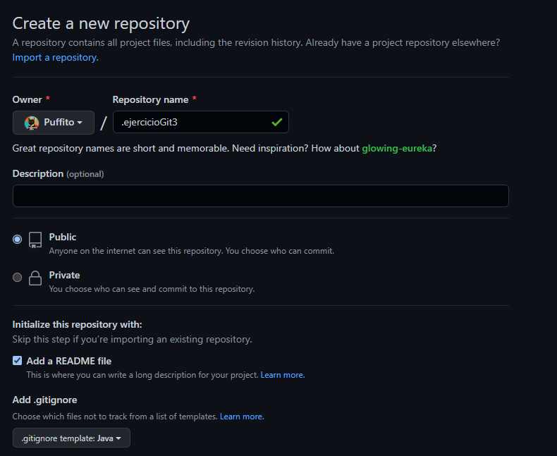

2. Creamos un proyecto nuevo marcando la opción "Create Git repository"

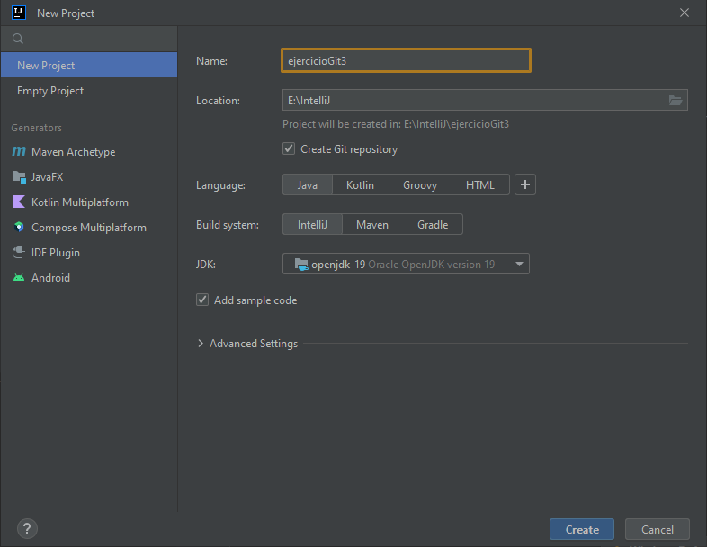

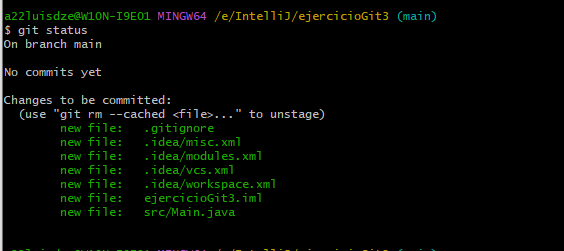

3. Añadimos el repo de github como remoto e intentamos hacer un pull (recordemos que lo hemos creado con un README y un .gitignore)

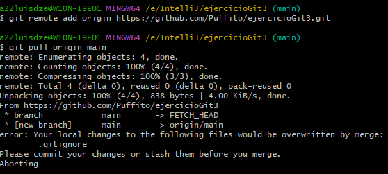

No podemos hacer un pull por tener cambios en stage local que no hemos commiteado (los ficheros del proyecto local). Al crear el proyecto marcando la opción "Create Git repository", se ha hecho un git init y, aparentemente, se han añadido al stage (se ha hecho un git add) pero no hemos hecho un commit.

4. Quitamos los cambios del stage (deshacemos el git add)

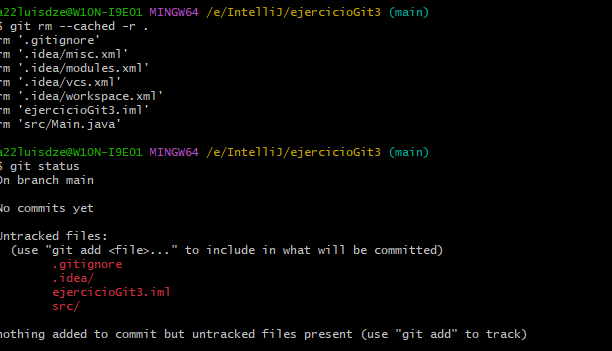

5. Ahora los cambios están sin trackear. Intentamos de nuevo hacer un pull.

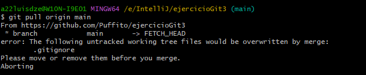

Al haber creado un .gitignore en remoto y otro en local, hay un conflicto entre estos ficheros.

6. Podemos eliminar el .gitignore local si queremos quedarnos con el remoto:

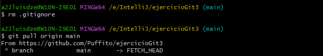

7. Ya tenemos descargado lo que estaba en remoto (el README y el .gitignore de GitHub) en la rama main (rama por defecto en GitHub) a nuestra rama master local.

Ahora commiteamos el proyecto local y lo subimos al repositorio.

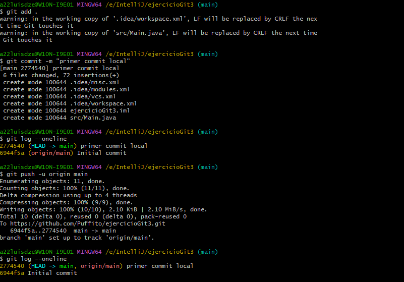

Observamos que se ha subido correctamente pero en la rama master (que era en la que estábamos trabajando en local), mientras que la rama main se mantiene con su primer commit.

8. Eliminamos la rama main en el repositorio de GitHub

9. Modificamos el proyecto local (commit: "añadiendo código para probar las propiedades de Java")
10. 


Si en algún momento se nos olvida algo en un commit, podemos enmendarlo con

```bash
git commit --ammend
```

que nos pediría editar el mensaje del commit, o con

```bash
git commit --ammend --no-edit
```

que dejaría el mismo mensaje (aunque cambia el hash ya que el contenido y la hora del commit ha cambiado, es un commit distinto que el que teníamos.)

10. Creamos una nueva rama para corregir un bug:  
   
    Las especificaciones de nuestro programa nos impiden que una persona cambie de nombre.

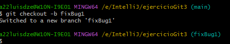

git checkout sirve para cambiar de commit (en este caso de rama, una rama es un identificador que apunta a un determinado commit --que es el último de su rama--'). La opción -b crea una rama nueva (no podríamos hacer checkout a una rama que no existe).

También se podría hacer en dos pasos con:

```bash
git branch fixBug1 ## Crea la rama
git checkout fixBug1 ## Salta a ella
```

11. Corregimos este problem, commiteamos la corrección en la rama y la pusheamos.


12. Mergeamos a master la rama con el bug ya solucionado

```
avida@DESKTOP-EG6VTFK MINGW64 ~/TRABAJO/cd/ejercicioGit3 (fixBug1)
$ git checkout master 

avida@DESKTOP-EG6VTFK MINGW64 ~/TRABAJO/cd/ejercicioGit3 (master)
$ git merge fixBug1 
Updating 858e9c9..a31ffce
Fast-forward
 .idea/workspace.xml | 23 +++++++++++++++++------
 src/Empleado.java   |  2 +-
 src/Main.java       |  4 +++-
 3 files changed, 21 insertions(+), 8 deletions(-)
```
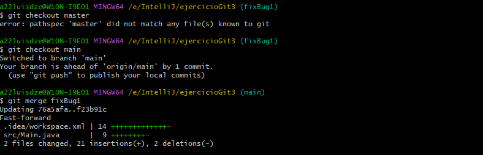

13. Añado este README y la carpeta de imágenes.
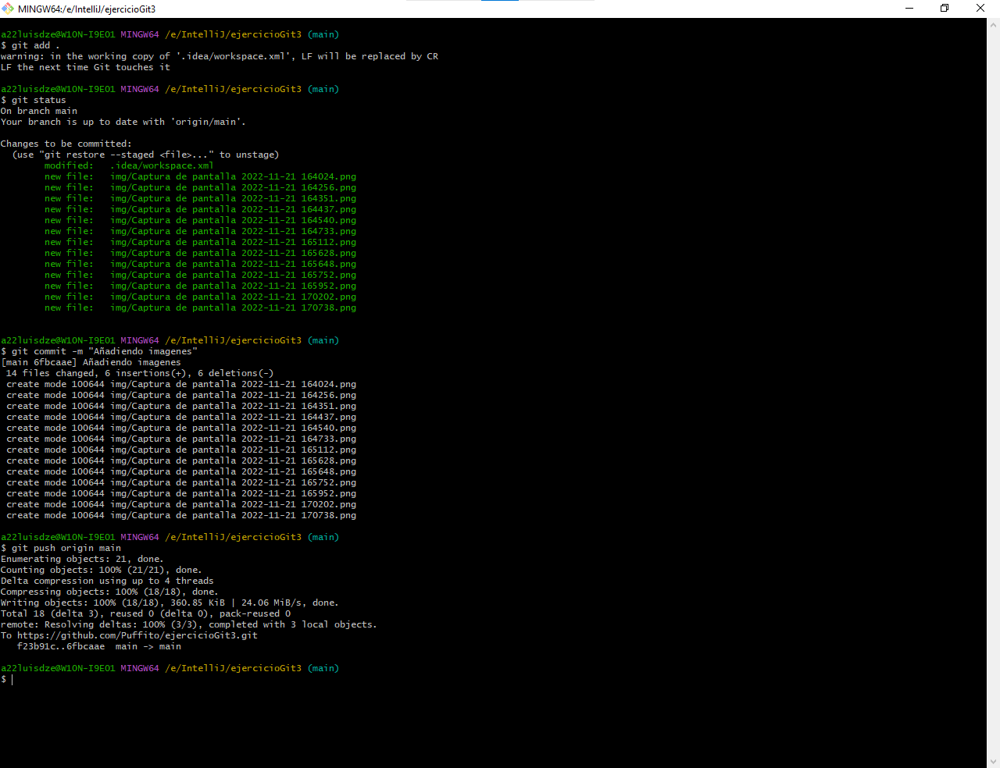
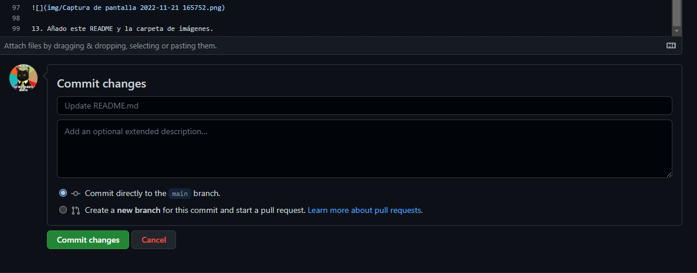
